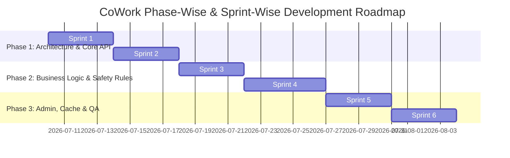

# CoWork: Multi-Tenant Coworking Space Booking API
## Phase-Wise & Sprint-Wise Development Plan

This document outlines the structured development plan for building the **CoWork** REST API based on the requirements specified in [ICT_Fest_Hackathon_Preliminary.md](file:///Users/azizursmac/Documents/GitHub/Agentic_AI_Hackathon_Mock/ICT_Fest_Hackathon_Preliminary.md). 

The roadmap is divided into **3 major phases**, each split into **2 target sprints**, progressing from setup to advanced logic and verification.

---



---

## Architecture Overview

CoWork is built on **FastAPI**, **SQLAlchemy** (using **SQLite** as the database backend), and **python-jose** for secure token-based authentication. 

```
app/
├── main.py                # FastAPI entry point & global error handlers
├── config.py              # Configuration & Environment variable loading
├── database.py            # SQLite engine, connection pool, and session generator
├── models.py              # SQLAlchemy database schemas
├── schemas.py             # Pydantic request/response models
├── serializers.py         # DB model-to-response dictionaries mapping
├── auth.py                # Password hashing, JWT token issue, and validation dependencies
├── cache.py               # In-memory caching layer for availability & reports
├── errors.py              # Domain-specific exceptions and handlers
├── timeutils.py           # ISO 8601 parsing, UTC normalizers
├── routers/               # APIRouter endpoints
│   ├── auth.py
│   ├── rooms.py
│   ├── bookings.py
│   ├── admin.py
│   └── health.py
└── services/              # Pure business logic services
    ├── refunds.py         # Cancellation refund calculator
    ├── stats.py           # Live statistical aggregator
    ├── rate_limiter.py    # Rolling rate limit evaluator
    ├── ref_codes.py       # Thread-safe booking reference code generator
    ├── export.py          # CSV generation utility
    └── notifications.py   # Mock email dispatcher
```

---

## Phase 1: Architecture & Core API Setup

Ensure the database schema, models, user registry, and multi-tenant authentication functions are solid.

### Sprint 1: DB Schema & Auth Foundation
*   **Database Schema & Models (`app/models.py`)**:
    *   **`Organization`**: `id` (int, PK), `name` (str, unique)
    *   **`User`**: `id` (int, PK), `org_id` (int, FK), `username` (str, unique within organization), `hashed_password` (str), `role` (enum: `admin`, `member`), `created_at` (datetime)
    *   **`Room`**: `id` (int, PK), `org_id` (int, FK), `name` (str), `capacity` (int), `hourly_rate_cents` (int)
    *   **`Booking`**: `id` (int, PK), `room_id` (int, FK), `user_id` (int, FK), `start_time` (datetime), `end_time` (datetime), `status` (enum: `confirmed`, `cancelled`), `reference_code` (str, unique), `price_cents` (int), `created_at` (datetime)
    *   **`RefundLog`**: `id` (int, PK), `booking_id` (int, FK), `amount_cents` (int), `status` (enum: `processed`, `failed`), `processed_at` (datetime)
*   **Registration & Auth Operations (`app/auth.py`, `app/routers/auth.py`)**:
    *   **`POST /auth/register`**: If `org_name` is unknown, create organization & set registration caller to `admin`. If known, register user as `member` of the existing organization. Raise `USERNAME_TAKEN` (409) if username exists in the organization.
    *   **`POST /auth/login`**: Verify credentials, issuing access (expires in 900s) and refresh (expires in 7 days) tokens.
    *   **`POST /auth/refresh`**: Verify/rotate tokens. Single-use refresh tokens: revoke the old one, issue new access & refresh tokens. Raise 401 if reused.
    *   **`POST /auth/logout`**: Invalidate/blacklist the current access token immediately.

### Sprint 2: Room & Booking CRUD with Strict Isolation
*   **Rooms Management (`app/routers/rooms.py`)**:
    *   **`GET /rooms`**: List rooms in the user's organization.
    *   **`POST /rooms`**: Create room (Admin-only).
*   **Booking CRUD & Pagination (`app/routers/bookings.py`)**:
    *   **`GET /bookings`**: Fetch user's bookings, paginated (default 10, max 100 items per page), sorted ascending by `start_time` (fallback to ascending `id`). Returns `{"items": [...], "page": int, "limit": int, "total": int}`.
    *   **`GET /bookings/{id}`**: Fetch details of a single booking, including `RefundLog` records.
*   **Multi-tenant Isolation**:
    *   A user can only read or modify data of their own organization.
    *   **Cross-Tenant Requests**: Accessing cross-org resource IDs (e.g. room/booking from another org) must yield `404 NOT FOUND` instead of `403 FORBIDDEN` to prevent data fishing.

---

## Phase 2: Business Logic & Safety Rules

Introduce robust input handling, validation parameters, rate-limit systems, and concurrency controls.

### Sprint 3: Normalization & Cancellation Policy
*   **Datetime Normalization (`app/timeutils.py`)**:
    *   Interpret all incoming offsets as UTC, and treat naive inputs as UTC.
    *   Ensure all API responses return UTC datetimes ending with explicit UTC indicators (e.g., `Z`).
*   **Booking Duration & Time Bounds**:
    *   Validate that booking duration is a whole number of hours, min 1, max 8.
    *   Verify `end_time` is strictly after `start_time`, and `start_time` is strictly in the future. Raise `INVALID_BOOKING_WINDOW` (400) if checks fail.
*   **Cancellation Policy (`app/services/refunds.py`, `app/routers/bookings.py`)**:
    *   Owner or org admin only can trigger cancel.
    *   Calculate notice: `Notice = start_time - cancellation_time`.
    *   Scale: $\ge 48$h notice $\implies$ 100% refund; $24\text{h} \le \text{notice} < 48$h notice $\implies$ 50% refund; $< 24$h notice $\implies$ 0% refund.
    *   Round to nearest cent, half-cents rounded up.
    *   Raise `ALREADY_CANCELLED` (409) if already cancelled. Generate exactly one `RefundLog` record per cancellation.

### Sprint 4: Concurrency Protection & Rate Limits
*   **No Double-Booking**:
    *   Block overlap on the same room: `existing.start < new.end AND new.start < existing.end`.
    *   Allow back-to-back bookings.
    *   Must handle concurrent requests. Raise `ROOM_CONFLICT` (409).
*   **Member Booking Quotas**:
    *   Members are limited to a maximum of 3 confirmed bookings in the next 24 hours (`(now, now + 24h]`) across the organization.
    *   Admins are exempt. Raise `QUOTA_EXCEEDED` (409) on failure.
*   **Unique Reference Codes (`app/services/ref_codes.py`)**:
    *   Generate collision-free, thread-safe reference codes for every booking.
*   **Rate Limiting (`app/services/rate_limiter.py`)**:
    *   Implement rolling window rate limit of 20 requests per 60 seconds per user on `POST /bookings`.
    *   Count all successful and failed attempts. Raise `RATE_LIMITED` (429) on violation.
*   **Implementation Strategy**: Enforce database level locking (`SELECT ... FOR UPDATE`), transaction isolation levels, or retries with exponential backoffs to prevent concurrent updates from causing race conditions.

---

## Phase 3: Admin, Cache & QA

Implement organization-wide reports, caching engines, and comprehensive concurrency-based validation.

### Sprint 5: Reports, CSV Export & Cache
*   **Usage Report (`app/routers/admin.py`)**:
    *   **`GET /admin/usage-report?from=...&to=...`**: Sum up confirmed bookings count and revenue for each room (including those with 0 bookings) starting in the range `[from, to]` (inclusive). Must be live data.
*   **CSV Data Export (`app/services/export.py`)**:
    *   **`GET /admin/export`**: Export all organization bookings as a CSV file.
    *   CSV Headers: `id,reference code,room id,user id,start time,end time,status,price cents`.
*   **In-Memory Caching (`app/cache.py`)**:
    *   Cache room availability and room stats to boost request speeds.
    *   Use write-through updates to invalidate/modify the cache atomically on any booking additions, cancellations, or edits.

### Sprint 6: Concurrency Testing & Liveness
*   **Testing Suite Setup (`tests/`)**:
    *   Build complete unit & integration tests validation registry, auth routing, multi-tenancy limits, and admin endpoints.
*   **High Concurrency Verification**:
    *   Deploy multithreaded test scripts to simulate simultaneous booking creation for the same room, booking quota violations, and cancellation triggers.
    *   Verify thread safety under heavy loads, ensuring the SQLite database does not lock up or dead-lock, maintaining overall API liveness.

---

## API Error Code Reference Table

All application errors must return a JSON response with status codes and application error codes matching:

| Error Case | HTTP Status | App Error Code (`code`) |
| :--- | :---: | :--- |
| Duplicate username within organization | 409 | `USERNAME_TAKEN` |
| Invalid credentials | 401 | `INVALID_CREDENTIALS` |
| Overlapping booking conflict | 409 | `ROOM_CONFLICT` |
| Member booking quota exceeded | 409 | `QUOTA_EXCEEDED` |
| Rate limit hit | 429 | `RATE_LIMITED` |
| Cancelling an already cancelled booking | 409 | `ALREADY_CANCELLED` |
| Booking ID does not exist / Cross-org | 404 | `BOOKING_NOT_FOUND` |
| Room ID does not exist / Cross-org | 404 | `ROOM_NOT_FOUND` |
| Access forbidden | 403 | `FORBIDDEN` |
| Invalid booking duration / past booking | 400 | `INVALID_BOOKING_WINDOW` |
| Missing/expired/invalid JWT token | 401 | - |
