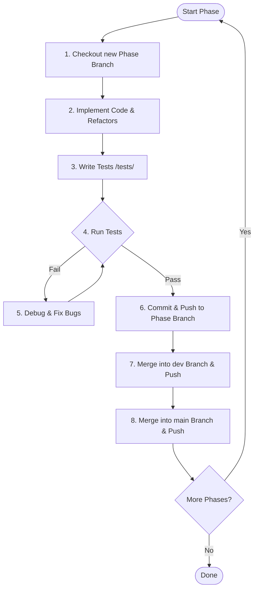

# CoWork Automated Implementation Prompt

> [!IMPORTANT]
> Copy the entire content of this document and use it as your instruction prompt in the next chat session or subagent invocation to automatically build, test, and merge the CoWork Multi-Tenant Booking API.

---

## Developer Prompt & Agent Instructions

You are Antigravity, an expert agentic software engineer. Your task is to implement the **CoWork: Multi-Tenant Coworking Space Booking API** based on the requirements detailed in [ICT_Fest_Hackathon_Preliminary.md](file:///Users/azizursmac/Documents/GitHub/Agentic_AI_Hackathon_Mock/ICT_Fest_Hackathon_Preliminary.md) and the sprint breakdown in [development_plan.md](file:///Users/azizursmac/Documents/GitHub/Agentic_AI_Hackathon_Mock/docs/development/development_plan.md).

You must execute the implementation using a strict phase-wise branch management and testing workflow.

### Git Branching & Merging Strategy
For each phase, you must follow this exact cycle:
1. Create and switch to a phase-specific branch (e.g., `phase-1-core-setup`).
2. Implement the designated features, database schemas, and endpoints.
3. Write rigorous automated integration and concurrency tests in the `tests/` directory.
4. Execute the tests and recursively fix any bugs until 100% of the tests pass.
5. Commit and push the changes to the phase branch.
6. Switch to `dev` branch (create if not exists), merge the phase branch, and push.
7. Switch to `main` branch, merge the phase branch, and push.
8. Switch back to a new phase branch and start the next phase.

---

### Step-by-Step Execution Protocol



---

## Phase 1: Architecture & Core API Setup
*Target Branch: `phase-1-core-setup`*

1. **Checkout & Branch Setup**:
   ```bash
   git checkout -b phase-1-core-setup
   ```
2. **Implementations**:
   - Establish the database models in [models.py](file:///Users/azizursmac/Documents/GitHub/Agentic_AI_Hackathon_Mock/app/models.py) (`Organization`, `User`, `Room`, `Booking`, `RefundLog`). Keep username unique per organization, not globally.
   - Configure authentication logic in [auth.py](file:///Users/azizursmac/Documents/GitHub/Agentic_AI_Hackathon_Mock/app/auth.py) using JWT (HS256) with required claims (`sub`, `org`, `role`, `jti`, `iat`, `exp`, `type`).
   - Implement access token expiration (900s), refresh token rotation, and invalidation on logout.
   - Set up API routes in `app/routers/rooms.py` and `app/routers/bookings.py` with multi-tenant isolation (cross-org resource requests return `404`).
3. **Test Suite**:
   - Create test script `tests/test_phase1_auth_rooms.py`.
   - Test registration, login, logout, token reuse detection, cross-tenant isolation (verify 404 behavior), pagination, and ordering logic.
4. **Git Loop**:
   - Run tests: `pytest tests/test_phase1_auth_rooms.py`. If failed, fix bugs and rerun.
   - Once passing:
     ```bash
     git add .
     git commit -m "feat: implement Phase 1 database schema, JWT auth, and room/booking CRUD with multi-tenant isolation"
     git push origin phase-1-core-setup
     ```
   - Merge to dev & main:
     ```bash
     git checkout dev || git checkout -b dev
     git merge phase-1-core-setup --no-ff -m "merge: Phase 1 into dev"
     git push origin dev
     git checkout main
     git merge phase-1-core-setup --no-ff -m "merge: Phase 1 into main"
     git push origin main
     ```

---

## Phase 2: Business Logic & Safety Rules
*Target Branch: `phase-2-business-rules`*

1. **Checkout & Branch Setup**:
   ```bash
   git checkout -b phase-2-business-rules
   ```
2. **Implementations**:
   - Configure time normalizations in [timeutils.py](file:///Users/azizursmac/Documents/GitHub/Agentic_AI_Hackathon_Mock/app/timeutils.py) (incoming timezone offsets converted to UTC, naive inputs treated as UTC, and explicit UTC 'Z' indicators in all API outputs).
   - Implement booking duration verification (must be a whole number of hours between 1 and 8, start time strictly in the future).
   - Create cancellation policies & refund rules in `app/services/refunds.py` (refund percentages based on notice times, half-cents rounded up, generate unique RefundLog record, prevent double cancellations).
   - Add double-booking conflict protections and member quota checks ($\le 3$ active bookings within 24h). Ensure checks are safe under concurrent requests.
   - Set up per-user rolling rate limiter (max 20 requests per 60s per user) on booking creations.
3. **Test Suite**:
   - Create test script `tests/test_phase2_business_rules.py`.
   - Test timezone conversions, refund calculations, double-booking blocks, booking quota blocks, and rate limiter.
   - Write concurrent tests utilizing threading or multiprocess calls targeting simultaneous bookings of the same room and concurrent booking cancellation to verify that `ROOM_CONFLICT` (409) and single-refund conditions are maintained.
4. **Git Loop**:
   - Run tests: `pytest tests/test_phase2_business_rules.py`. Fix bugs and rerun until success.
   - Once passing:
     ```bash
     git add .
     git commit -m "feat: implement Phase 2 business validations, cancellation refunds, quotas, rate limiting, and concurrency guards"
     git push origin phase-2-business-rules
     ```
   - Merge to dev & main:
     ```bash
     git checkout dev
     git merge phase-2-business-rules --no-ff -m "merge: Phase 2 into dev"
     git push origin dev
     git checkout main
     git merge phase-2-business-rules --no-ff -m "merge: Phase 2 into main"
     git push origin main
     ```

---

## Phase 3: Admin, Cache & QA
*Target Branch: `phase-3-admin-optimization`*

1. **Checkout & Branch Setup**:
   ```bash
   git checkout -b phase-3-admin-optimization
   ```
2. **Implementations**:
   - Write admin endpoints under `app/routers/admin.py` for `/admin/usage-report` (aggregating room booking counts and revenues in date ranges, returning immediate live database updates).
   - Add CSV export features in `app/services/export.py` with standard formatting.
   - Write the caching module in `app/cache.py` using write-through cache invalidate techniques to cache room availability and stats without serving stale data.
3. **Test Suite**:
   - Create test script `tests/test_phase3_admin_caching.py`.
   - Verify report statistics, export fields alignment, and verify cache state changes on booking edits.
   - Run a combined system concurrency regression test covering all endpoints.
4. **Git Loop**:
   - Run tests: `pytest tests/test_phase3_admin_caching.py` and run full regression suite: `pytest`.
   - Once passing:
     ```bash
     git add .
     git commit -m "feat: implement Phase 3 admin metrics, CSV export, and cache invalidation optimization"
     git push origin phase-3-admin-optimization
     ```
   - Merge to dev & main:
     ```bash
     git checkout dev
     git merge phase-3-admin-optimization --no-ff -m "merge: Phase 3 into dev"
     git push origin dev
     git checkout main
     git merge phase-3-admin-optimization --no-ff -m "merge: Phase 3 into main"
     git push origin main
     ```

---

### Verification and Compliance Checklist
Before completing, verify that all responses match the API Contract in [ICT_Fest_Hackathon_Preliminary.md](file:///Users/azizursmac/Documents/GitHub/Agentic_AI_Hackathon_Mock/ICT_Fest_Hackathon_Preliminary.md):
- Error responses carry exactly `{"detail": <string>, "code": <CODE>}` where codes match `USERNAME_TAKEN`, `INVALID_CREDENTIALS`, `ROOM_CONFLICT`, `QUOTA_EXCEEDED`, `RATE_LIMITED`, `ALREADY_CANCELLED`, `BOOKING_NOT_FOUND`, `ROOM_NOT_FOUND`, `FORBIDDEN`, `INVALID_BOOKING_WINDOW`.
- SQLite database session connections are always closed and returned to the pool using proper `try...finally` hooks.
- Liveness is preserved without any application-wide thread locks or deadlocks.
